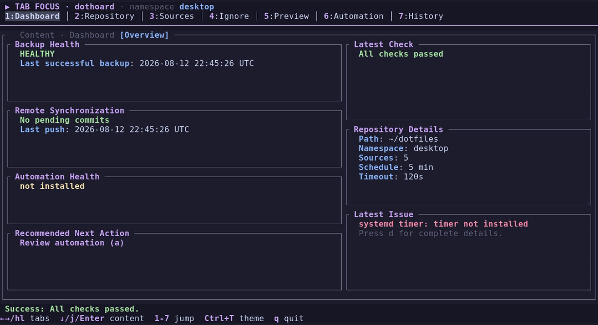
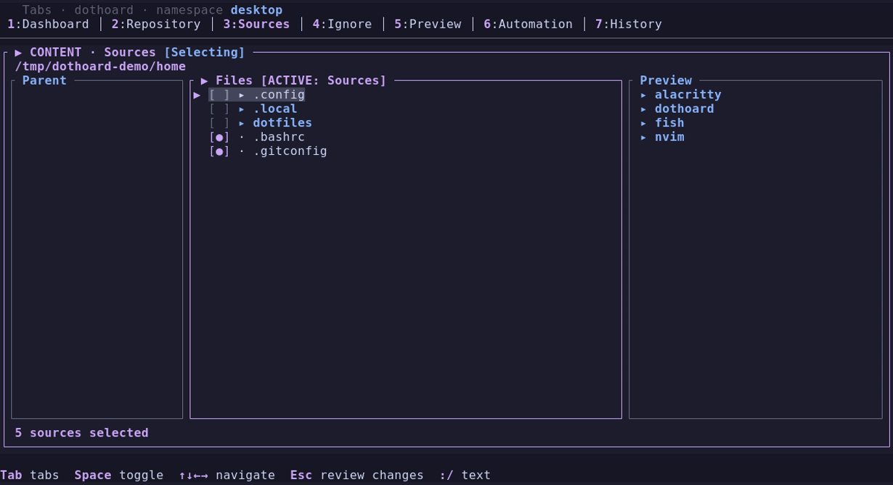
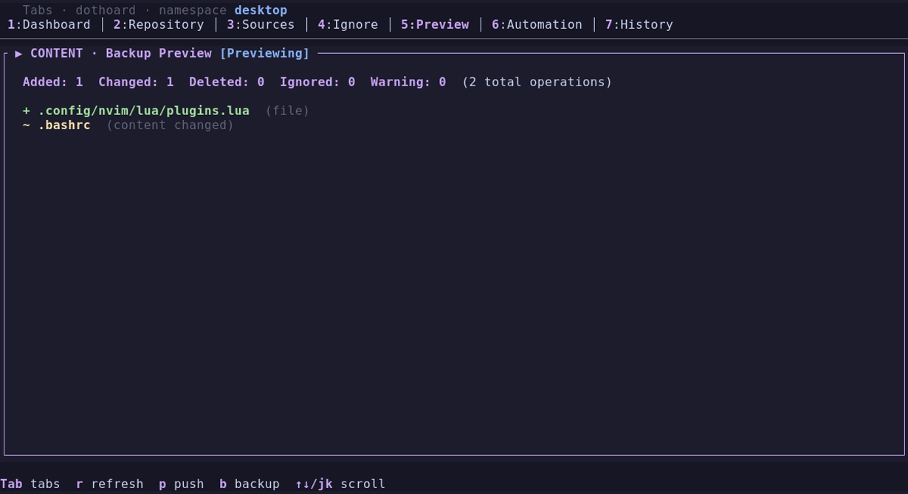

# dothoard

> Safe, Git-native dotfile backups for Linux — unattended when you want them,
> reviewable when you need them.

[](#project-status)
[](https://github.com/enriqTS/dothoard/actions/workflows/ci.yml)
[](LICENSE)

**[Documentation website](https://enriqts.github.io/dothoard/)**


`dothoard` copies selected files and directories from your home directory into a
dedicated Git repository, then commits and pushes them on demand or through a
scheduler. Its keyboard-first terminal UI configures sources, ignore rules,
namespaces, previews, and managed `systemd --user` automation; external
schedulers can invoke the same short-lived backup command.

**It is for Linux users who want a focused backup and synchronization tool for
their dotfiles without giving up control of the Git repository.** It is not a
restore manager, cloud backup service, persistent daemon, or general-purpose
repository manager.

## Project status

**Experimental.** The backend is extensively tested, but the TUI usability and
visual-design work is still in progress. Review previews and use a dedicated
repository before relying on it for important data. Supported and manually
smoke-tested platforms are CachyOS and Arch Linux. Other Linux distributions,
including non-systemd systems with a compatible user `crontab`, may work but are
not yet supported or manually smoke-tested.

## Why dothoard?



- **Safe boundaries:** it never follows symlinks while traversing, and every
  write or deletion stays inside the active namespace in the repository.
- **Git-native:** changes are ordinary Git commits that you can inspect,
  review, and synchronize with your usual tools.
- **Multi-machine aware:** each computer owns a named namespace and cannot
  stage, alter, or clean a sibling namespace.
- **Unattended by design:** scheduled Git operations are noninteractive and
  timeout-bounded; failed network sync keeps the local commit for a later run.
- **Review before backup:** preview exact additions, changes, deletions,
  exclusions, and likely-secret warnings before a manual backup.

Read the complete [safety model](docs/safety.md) before use. Ignore rules and
secret warnings reduce risk, but a committed secret remains in Git history and
must be rotated.

## Five-minute quick start

1. **Install prerequisites:** Git and either a systemd user session or a
   compatible cron implementation for managed automation (plus Rust 1.97+ if
   building from source).
2. **Create or clone a dedicated Git repository**—do not share it with another
   project.
3. **Install dothoard.** Download a prebuilt binary (pre-release; see the
   [release policy](docs/releases.md)):

   ```bash
   curl -fsSL https://raw.githubusercontent.com/enriqTS/dothoard/main/scripts/install.sh | sh
   ```

   Or build from source with Rust 1.97+:

   ```bash
   cargo install --path .
   ```

   Then open the TUI:

   ```bash
   dothoard
   ```

4. On first launch, dothoard opens **Repository** setup. Choose the clone, then
   select an existing namespace or explicitly create one—there is no default.
   Selecting an existing namespace restores its source selections and ignore
   rules from the manifest. After setup, Repository can browse inside the
   selected clone but cannot move to its parent; press `c` to choose another
   location starting from `~/`.
5. In **Sources**, review or change files and directories below `$HOME`. The
   browser Preview pane shows a selected regular file's content (up to 256
   KiB); use `Ctrl+↑`/`Ctrl+↓`, `Ctrl+k`/`Ctrl+j`, or the pointer wheel over the
   Preview pane to scroll it. Tabs, rows, browser checkboxes, and visible footer
   actions are also clickable. Then inspect **Preview** and run the first backup.
6. When the manual flow is working, install automation:

   ```bash
   dothoard service install
   ```

For commands, authentication, and a configuration-file workflow, see the
[quick-start guide](docs/quick-start.md).



## Documentation

Visit the documentation website at
[enriqts.github.io/dothoard](https://enriqts.github.io/dothoard/) or use the
repository guides below.

| I want to… | Read |
|---|---|
| Install and make a first backup | [Quick start](docs/quick-start.md) |
| Use the terminal UI with keyboard or pointer controls | [TUI guide](docs/tui.md) |
| Edit the configuration file | [Configuration reference](docs/configuration.md) |
| Exclude files safely | [Ignore rules](docs/ignore-rules.md) |
| Use one repository from several machines | [Namespaces](docs/namespaces.md) |
| Configure SSH or HTTPS for unattended Git | [Authentication](docs/authentication.md) |
| Schedule backups with systemd or an external scheduler | [Automation](docs/automation.md) |
| Understand limits, safety, and recovery | [Safety model](docs/safety.md) |
| Solve a common problem | [Troubleshooting](docs/troubleshooting.md) and [FAQ](docs/faq.md) |
| Build or contribute | [Development](docs/development.md) and [Contributing](docs/contributing.md) |

The TUI follows the terminal's configured foreground, background, and ANSI
colors by default, including live palette updates from desktop personalization
tools. Press `Ctrl+T` to choose a fixed built-in theme or return to the system
palette.

## Commands

```text
dothoard                 Open the TUI
dothoard backup          Run one backup immediately
dothoard check           Validate configuration and repository
dothoard service select  Select systemd or cron automation
dothoard service install Install and enable managed automation
dothoard service remove  Disable and remove managed automation
dothoard service status  Show managed automation status
```

Any scheduler can run `/absolute/path/to/dothoard backup`. Dothoard can manage a
systemd user timer or a clearly delimited user-crontab block; select the backend
in the Automation screen or with `dothoard service select`. See
[Backup automation](docs/automation.md) for cron environment and timing
considerations.

| Exit code | Meaning |
|---:|---|
| 0 | Success or no changes needed |
| 1 | Backup or operation failed |
| 2 | Another backup is already running |
| 3 | Configuration is missing or invalid |

## What a backup does

A run validates the configuration, repository, active namespace, and source
paths; blocks dirty changes outside that namespace; mirrors sources under
`<namespace>/home/`; updates the namespace manifest; stages only that
namespace; and commits, rebases, and pushes noninteractively. A source or
manifest failure prevents Git publication for that run. A network failure keeps
the local commit so a later run can push it.



## Repository layout

```text
repository/
|-- desktop/
|   |-- home/
|   |   `-- .config/...
|   `-- .dothoard-manifest.toml
|-- notebook/
|   |-- home/
|   `-- .dothoard-manifest.toml
`-- other repository content (untouched)
```

Each configured machine owns only its selected namespace. Selecting an owned
namespace loads its manifest's source paths and ignore rules into this machine's
local configuration; selecting a new namespace starts with an empty source
list. Root-level legacy `home/` data and sibling namespaces are unmanaged and
untouched. See
[Namespaces](docs/namespaces.md) for setup and lifecycle details.

## Development

```bash
cargo fmt --check
cargo clippy --all-targets --all-features -- -D warnings
cargo test --all-targets --all-features -- --test-threads=1
```

The test suite uses temporary directories and must not touch real dotfiles,
repositories, systemd user units, user crontabs, or desktop notifications. See
the [development guide](docs/development.md).

## Repository metadata

GitHub repository description, topics, and social-preview settings are managed
in the GitHub repository settings. Recommended description:

> Safe, Git-backed dotfile backups for Linux, with unattended sync and a
> keyboard-driven TUI.

Recommended topics: `dotfiles`, `backup`, `git`, `rust`, `linux`, `ratatui`,
`automation`, `systemd`, `cron`, `dotfile-manager`.

## Releases and security

Dothoard releases remain experimental and are clearly marked as pre-releases;
see [Experimental releases](docs/releases.md). To report a vulnerability,
follow the private reporting process in [SECURITY.md](SECURITY.md), not a public
issue.

## License

GPL-3.0-or-later. See [LICENSE](LICENSE).
